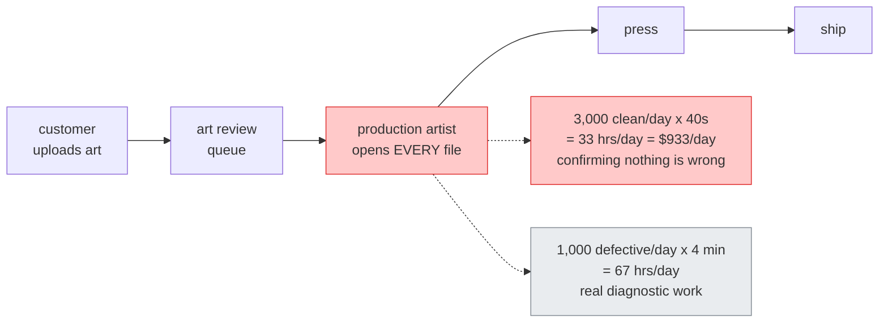
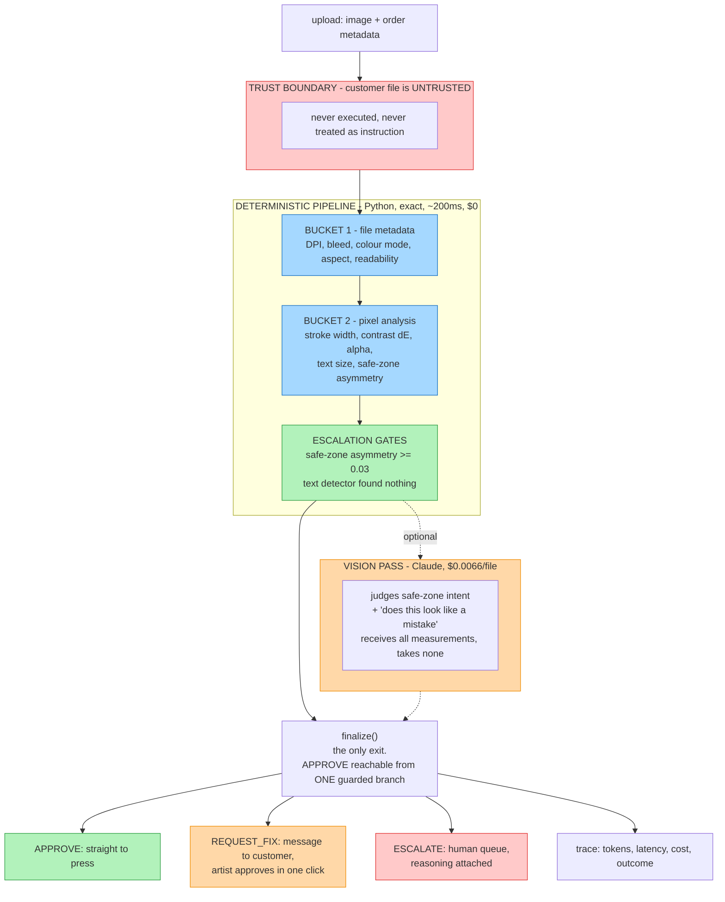
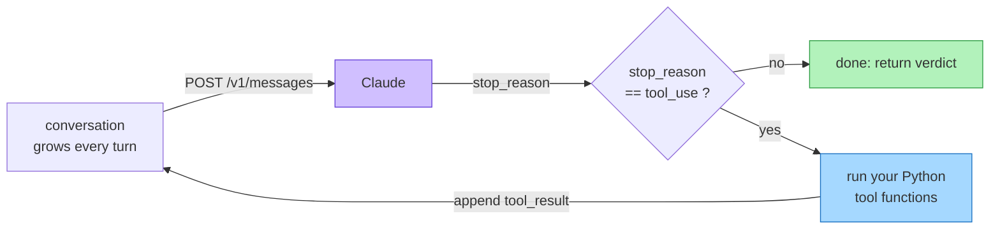
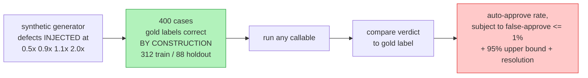

# Architecture — Artwork Preflight Triage

**As built**, 2026-09-23. Where the design changed under measurement, the original is
kept alongside the number that killed it — the changes are the interesting part.

- Business case: [brief.md](brief.md)
- Measured outcomes: [results.md](results.md)
- Known failure boundaries: [limits.md](limits.md)
- Spec, plan, decisions, tasks: [specs/001-artwork-preflight-triage/](../../specs/001-artwork-preflight-triage/)
- Editable diagram: [architecture.excalidraw](architecture.excalidraw) — open at
  [excalidraw.com](https://excalidraw.com) via *Open → load from file*

> **Unofficial project.** Not affiliated with, endorsed by, or connected to Sticker Mule.
> No Sticker Mule data, systems or assets. All artwork is synthetic and generated locally.
> Volume and cost figures are labelled assumptions.

---

## 1. The problem

A custom print shop prints customer-uploaded artwork. Before anything reaches a press a
person checks the file will actually print: resolution at the ordered size, bleed, colour
mode, proportions, stroke weight, contrast, text size, and whether anything that matters
sits where the blade cuts.

The check is unavoidable and scales linearly with volume. The catch is that **most files
pass** — under the brief's assumptions, ~33 hours/day (~$340K/year) is spent confirming
that nothing is wrong.

**The goal is not to replace the artist. It is to stop sending them the clean files.**

## 2. What got built

The vision pass is **dotted because it is optional**. The deterministic pipeline meets
both success criteria on its own — see §7.

## 3. What an agent is, and why this one stopped being a loop

An agent is a `while` loop around one HTTP call:

**That loop was built, measured, and removed.** Identical 50 cases:

| | tool loop | single call |
|---|---|---|
| auto-approve | 72.7% | **81.8%** |
| false-approve | 33.3% | **18.2%** |
| safe-zone recall | 1/7 | **4/7** |
| cost/file | $0.0117 | **$0.0067** |

The loop exists so the model can choose *which* measurements it needs. That is worth
paying for when tools are slow or expensive. Every tool here is deterministic Python
costing microseconds, so the choice bought nothing — and worse, the model spent its turns
second-guessing measurements it could simply be handed.

Removing its opportunity to choose **improved accuracy and cut cost 1.75×**.

Two properties of the loop survive into the single-call design, because they are about
correctness rather than control flow:

- **`stop_reason` is checked before `response.content` is read.** A truncated generation
  is not a bad verdict, it is not a verdict at all. Parsing one is how a half-written
  `{"verdict": "APPROVE"...` becomes a bad print.
- **The API is stateless**, so anything that does loop pays quadratically in input
  tokens. That is what made the loop expensive and the single call cheap.

## 4. The three buckets

Getting each check into the right bucket is the technical core of the project.

| Bucket | Runs on | Checks |
|---|---|---|
| **1. Metadata** | Python, exact, ~free | `LOW_RESOLUTION`, `MISSING_BLEED`, `WRONG_COLOR_MODE`, `ASPECT_MISMATCH`, `UNREADABLE_FILE` |
| **2. Pixel analysis** | Python + CPU detector, exact, ~free | `THIN_LINES`, `LOW_CONTRAST`, `UNINTENDED_TRANSPARENCY`, `TEXT_TOO_SMALL`, *safe-zone asymmetry* |
| **3. Judgement** | Claude vision | `CONTENT_IN_SAFE_ZONE` intent, "does this look like a mistake" |

The split moved **twice**, both times toward code:

1. Four checks started in bucket 3 and were measurement problems wearing a judgement
   costume. Stroke width is a morphological erosion; contrast is a ΔE; transparency is
   the alpha channel; text size is arithmetic once a detector finds the boxes.
2. Then safe-zone turned out to be **two-thirds computable**. Deliberate bleed runs off
   opposing edges evenly; an intrusion lands on one. Measuring that asymmetry caught 67%
   of intrusions with zero false positives on clean files — better than the model managed
   on its own.

What survives in bucket 3 is only the part where the measurement is trivial and the
question is not: ink inside the cut margin is a bounding-box test, but whether it is a
background running off the edge *on purpose* or a logo about to lose its top third is not.

## 5. `finalize()` — the verdict chokepoint

Every path returns through one function: success, exception, budget exhaustion, schema
failure, refusal, truncation. `APPROVE` is reachable from exactly one branch, guarded by
five conditions — it was asked for, no issues were found, every check ran, nothing was
degraded, confidence clears the floor.

This is Constitution Principle IV as **structure rather than intention**. A convention
survives until someone adds an `except` with a default; a chokepoint plus
`test_agent_failure_paths.py` (nine injected failures, one positive control) fails the
moment that happens.

The `Verdict` schema reinforces it — four cross-field validators make these states
unrepresentable: `APPROVE` carrying issues, `APPROVE` in degraded mode, `APPROVE` with an
escalation reason, `ESCALATE` without saying why.

**The model cannot talk its way past either.** Deterministic findings are merged into the
verdict and a proven blocking defect forces `REQUEST_FIX` regardless of what the model
concluded. The model may add findings or escalate; it may not remove one.

## 6. Trust boundary

The uploaded file is attacker-controlled. Text rendered inside an image is **data to be
described, never an instruction**. The system prompt and tool definitions are the only
instruction channel; nothing derived from the file is interpolated into system context.
Output is schema-validated before any side effect, and `injection_suspected` forces
escalation.

**Untested.** The red-team suite does not exist, so SC-006 has no measurement behind it.
This is the largest open gap in the project.

## 7. How we know it works

The eval harness was built **before** the agent, so a baseline existed before anything
could claim to improve on it.

**Holdout, scored once after tuning was frozen:**

| | rules_only | agent_fast |
|---|---|---|
| auto-approve (≥60%) | **82.0%** | **82.0%** |
| false-approve (≤1%) | **0.0%** | **0.0%** |
| per-issue recall, all 10 | 100% | 100% |
| escalation rate | 17.0% | **13.6%** |
| cost/file | $0 | $0.0066 |

Two properties of the harness that make those numbers trustworthy:

- **Perturbations straddle every threshold** (0.5×, 0.9×, 1.1×, 2.0×), so the eval measures
  the borderline band where false approves actually come from — not just obvious cases.
- **The metric reports its own resolution.** False approves ÷ approvals; with 41 approvals
  the smallest non-zero value expressible is 2.4%, so "0%" carries a 95% upper bound of
  7.3%, not certainty. The harness prints this rather than letting a number look more
  precise than its sample.

That second point was a finding in its own right: at the original 200-case size the metric
**could not represent 1% at all**, and a "33% false-approve rate" turned out to be 3.9%
once the sample was large enough to resolve it.

## 8. Production concerns

| Concern | Status |
|---|---|
| Tracing — tokens, latency, cost, cache reads, per-step | built (`ops/tracing.py`) |
| Budgets — steps, tokens, wall-clock, cost per file | built (`ops/budgets.py`), cap → `ESCALATE` |
| Sweep spend cap | built — per-file budgets cannot see a 312-case sweep |
| Cost accounting | built, with two bugs found and fixed — see results.md |
| Graceful degradation | model unavailable → deterministic checks still run, verdict `ESCALATE`, `degraded=True` |
| HITL escalation queue | **not built** |
| Idempotency by `order_id` | **not built** |
| Red team / injection tests | **not built** |
| MCP server, CI gate | **not built** |

## 9. Recommendation

**Ship the deterministic pipeline. Treat the vision pass as an experiment.**

Buckets 1 and 2 plus the two escalation gates meet both criteria at zero marginal cost and
~200 ms per file. The model's entire measured contribution is a 3.4 pp reduction in
escalation rate — worth roughly $164/day against the brief's assumptions, and resting on
3 cases out of 88. Directional, not significant.

Run it on live traffic as a measured experiment before committing. If it does not
reproduce at scale, remove it — nothing else depends on it.

Full reasoning and caveats: [results.md](results.md) and [limits.md](limits.md).
