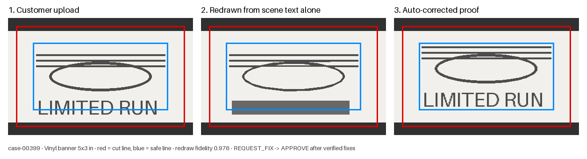

# Measure → Describe → Verify → Narrate

**How a small text model can explain an image, and suggest fixes, without seeing it.**

**Date:** 2026-09-23 · **Status:** spike, measured offline · **API spend:** $0.00 ·
**Code:** `capstone/tools/scene.py`, `capstone/tools/fixes.py`, `capstone/src/narrate.py`

> **Unofficial project.** Not affiliated with Sticker Mule. All artwork is synthetic.
> Every number is an upper bound on real uploads (limits.md §1).

---

## 1. The question

The decider ([decider.md](decider.md)) approves or escalates using five numbers, with no
model. The ask was the next step: send engine-derived data to a small model so it can
give context about the image and suggest fixes, **without relying on the model for
vision**.

The obvious version — describe the image in text, ask a model what it thinks — has two
known failure modes, and the design below exists to close both:

1. **A text model can only reason about what the description contains**, and nobody
   knows what the description dropped. Structured scene representations help LLM
   reasoning, but hallucination and lossy descriptions are the open problem
   ([Scene Graph Thinking, ICML 2026](https://icml.cc/virtual/2026/poster/62346);
   [schema-guided scene-graph reasoning](https://arxiv.org/pdf/2502.03450)). LLMs are
   notably weak on low-level geometry formats such as raw SVG
   ([VGBench](https://arxiv.org/abs/2407.10972)).
2. **A model that produces numbers will sometimes produce wrong ones**, and a wrong
   number in a customer message is the second-ranked failure mode in brief.md §6.

## 2. The pipeline

```
upload
  │
  ├─ MEASURE    rules + OpenCV (buckets 1-2, decider features)            exact, $0
  │
  ├─ DESCRIBE   scene document: every element's shape, colour, position   scene.py
  │             in inches from the trim, clearance to the safe line
  │     └─ VERIFY the description: redraw the artwork from the text
  │               alone, compare to the real pixels  →  fidelity score
  │
  ├─ FIX        applied fixes on a proof image (bleed, safe zone, hairlines,  fixes.py
  │             colour mode) + exact suggestions for the rest
  │     └─ VERIFY the fixes: re-run the whole preflight on the proof
  │               → proof_ready only if every fix verified, nothing new broke
  │
  └─ NARRATE    small text model writes the customer message and reviewer   narrate.py
                note from the scene + fixes
        └─ VERIFY the narration: every id and every number must exist in
                  the engine's output, or the deterministic template ships
```



*holdout_v3 case-00399, a 5x3 in vinyl banner. Red is the cut line, blue the safe line.
The upload's text runs into the keep-out margin (a defect the generator labels clean —
limits.md §11). The middle panel is drawn only from the scene document a model would
receive: fidelity 0.976, text shown as a box because its content is never sent. The
proof re-centres the design without resizing it and converts the colour mode; the
re-check passes and the element count is unchanged.*

Each step that could be wrong is followed by a check that runs on the step's own output,
not on trust. The model sits at the very end, does the one thing it is best at
(language), and cannot introduce a fact.

### What is new here

Individually these are known techniques. The combination for print preflight is the
contribution:

| Technique | Where it comes from | What it does here |
|---|---|---|
| Image → structured scene for an LLM | scene-graph reasoning literature | Scene document in trim-relative inches, designed for the question being asked |
| **Render-and-compare** | inverse graphics ([VIGA](https://arxiv.org/pdf/2601.11109), [IR3D-Bench](https://arxiv.org/html/2506.23329v1)) | **Measures how complete the description is** before any model reads it. Below 0.9 (`FIDELITY_FLOOR`) no model is called and the template ships. |
| Auto-fix preflight | PitStop / pdfToolbox ([Enfocus](https://www.enfocus.com/en/pitstop-pro)) — rule-based, mirror-to-bleed | Same class of fixes, plus **re-verification by the full pipeline** and a refusal to apply what would be dishonest (upscaling, re-colouring) |
| Grounded generation | general practice | **Numeric claim-checking**: every number the model writes must be an engine value at the precision written, or the narration is discarded |

The render-and-compare gate is the answer to failure mode 1: instead of hoping the text
captured the image, the pipeline redraws the image from the text and measures the gap.
Inverse-graphics work uses this loop to make *models* reconstruct scenes; here it
certifies a *deterministic* description before a model is allowed near it.

## 3. Measured results

Train split for development; **shifted_v3 is the untouched set** for the fix engine
(holdout_v3 was used to find two bugs, below, so its fix numbers are reported but are
not clean).

### Describe

| | shifted_v3 (278 files) |
|---|---|
| redraw fidelity (ink IoU, text excluded) | median **0.975**, min 0.931; 274/278 ≥ 0.95 |
| elements per file | median 7, max 31 |
| scene size | ~755 tokens median (estimate: chars / 3.5) |
| time | 0.17 s/file |

The scene does not grow with resolution. A real 2,000-4,000 px upload costs ~1,600
image tokens; its scene costs the same ~750 as a 400 px file.

### Fix and verify

| | holdout_v3 (282 not approved) | **shifted_v3 (184 not approved)** |
|---|---|---|
| applied fixes verified | 230/245 | **125/128** |
| — bleed / colour / transparency | 38/38 · 31/31 · 12/12 | 22/22 · 15/15 · 5/5 |
| — design fit inside the safe line | 74/74 | 33/33 |
| — thin lines † | 75/90 | 50/53 |
| **print-ready proofs, zero humans** ‡ | **88 (31%)** | **43 (23%)** |
| proofs hiding an unaddressed injected defect | 0 * | 0 * |
| suggestions with exact targets | 227 | 144 |

\* Excluding transparency labels on products that *permit* transparency — a known rule
gap (limits.md §2); the CMYK conversion flattens the alpha in each.
† Verified per issue code: when one line on a file is too close to its neighbours to
thicken (it becomes a suggestion), THIN_LINES stays open and the lines that *were*
thickened on that file are conservatively counted unverified too.
‡ `proof_ready`: every applied fix verified, nothing blocking left, same number of design
elements as the upload — and the decider approves the proof.

**Disclosure.** shifted_v3 was scored with an earlier version of the fix engine (134/134,
44 proofs). Items 7-8 below were then found on train and holdout_v3 and fixed; shifted_v3
was re-scored, not tuned on. The earlier figure counted proofs where hairlines had merged.

### Narrate

| | |
|---|---|
| template narrations passing the claim check | **306/306** (no false positives) |
| fabricated numbers / ids caught | every case in the tests, incl. a fake model client |
| model input | ~820 tokens median incl. fixes |
| live model run | **not run — see §5** |

## 4. What went wrong on the way (kept deliberately)

1. **Ellipse-fitting misdescribed merged shapes** (fidelity 0.82 on a clean file). Two
   stripes touching an outline merged into one component and were redrawn as a full
   ellipse. Fixed with polygon rings (the SVG-path equivalent): median fidelity 0.955 →
   0.975. Render-and-compare found this; nothing else would have.
2. **Per-element moves verified 40 of 158.** Elements wider than the safe area cannot be
   moved clear, and undetected text arrives as glyph blobs that per-element moves would
   scatter. Replaced with fitting the whole layout, as a prepress artist does, capped at
   a 15% shrink before it becomes a suggestion.
3. **"Verified" was vacuous for the safe zone.** The safe-zone rule is advisory, so
   "not in the blocking set" passed every move. Now re-measured from a fresh scene of
   the proof.
4. **Thickened hairlines were left behind as slivers** when the fit moved their original
   boxes. Found because 13 fixes failed re-verification.
5. **A stretched file was "fixed" by padding it to the right canvas** (holdout_v3,
   case-00521). Every rule passed; the design inside stayed stretched. Bleed is now
   padded only when it is missing equally on every side.
6. **An unverified fix still reached "approve"** (case-00593): the decider accepted the
   proof although the fit had not verified. Now `proof_ready` requires every applied fix
   to verify — one failure sends the file to a person.

7. **Thickening merged parallel hairlines into one bar** in 17 of 19 thickening cases.
   Every rule passed. Found only by *looking at a rendered proof*. Two changes: a stroke
   is thickened only if the result keeps a clear gap to everything else (otherwise it
   becomes a suggestion), and `proof_ready` now requires the proof to keep the same
   number of distinct design elements as the upload.
8. **Faint antialiasing fragments were left behind as specks** when the design moved —
   too small to be elements, so no check saw them. The fit now moves everything inside
   the design's region, not just the pixels inside known element boxes.

Items 5-7 are the important ones: **verification is only as good as the checks it
re-runs.** Each was fixed by tightening what counts as verified, never by loosening a
threshold. Item 7 is the uncomfortable one: no automated check found it; a picture did.
Any production version needs a human to look at a sample of auto-corrected proofs.

## 5. Local model (Ollama) and blockers — updated 2026-09-24

The narrator is now a backend behind one checked path (`capstone/src/narrators.py`):
Claude through the Anthropic SDK, or **any local model served by Ollama**, both judged by
the same claim check. The Ollama backend uses the standard library (no new dependency),
asks for schema-constrained JSON, runs at temperature 0 with an 8K context so the facts
are never silently truncated, and treats an unreachable server as a fallback, not an
outage. It is tested against a real HTTP server speaking Ollama's wire format.

To benchmark local models (on any machine with Ollama):

```bash
ollama pull qwen2.5:3b && ollama pull llama3.2:3b && ollama pull phi4-mini
python -m capstone.evals.narration_eval --backend ollama \
    --model qwen2.5:3b --model llama3.2:3b --model phi4-mini --out drafts.jsonl
```

It reports each model's **pass rate** (share of narrations that survive the claim check),
fallback reasons and latency, and writes every draft for a human to read.

| Blocker | Status |
|---|---|
| **Ollama blocked here** | `ollama.com` and `registry.ollama.ai` are denied by this environment's network policy, so neither the binary nor weights can be fetched. Allow both hosts in the environment's network settings, or run the benchmark on your machine. |
| Jev | Deferred by decision (early access); the decider slot is ready for it. |
| Real artwork | Now measured: [real-art.md](real-art.md). Real *customer* uploads are still unavailable. |

**Estimated cost if a hosted model narrates** (assumption, not measured): ~1,100 input +
~300 output tokens on Haiku 4.5 ≈ $0.0026 per narrated file. A local model moves that to
hardware already owned; the benchmark's latency column decides whether it can sit in the
upload path.

## 6. Two properties that come free

- **Prompt injection via artwork text has no carrier.** The scene holds a text line's
  position and point size, never its content. limits.md §8 calls injection through
  rendered text "the attack this design invites"; on this path the model never receives
  the text. (If OCR is ever added for spell-checking, this property ends and needs its
  own defence.)
- **The model is optional.** The template narrator passes the claim check by
  construction and is what ships when the model is down, slow, over budget, or wrong.
  Degradation is a quality change in wording, never a change in facts.

## 7. What this does not show

- **The proof is right by the checks, not by a person.** Fixes are verified by the same
  rules that found the problem. §4 items 5-6 show how that can mislead; the customer's
  proof approval, which the business flow already has, remains the final check.
- **Scaling the design is a design decision**, even at 97%. It is applied only because
  the output is a proof the customer approves, never a silent change to what prints.
- **Text content is invisible** to every step: no spell-check, no "is this the right
  phone number". That is the price of the injection property above.
- **Fidelity measures ink placement, not meaning.** A redraw can match every pixel and
  the scene still cannot say "this is a logo".

## 8. Reproduce

```bash
pytest capstone/tests/test_scene_fixes_narrate.py          # offline, includes a fake model
pytest -m integration capstone/tests/test_scene_fixes_narrate.py   # needs a key
```
